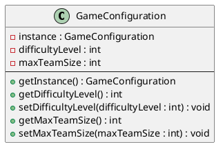
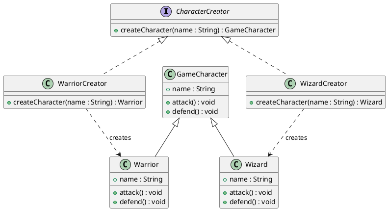
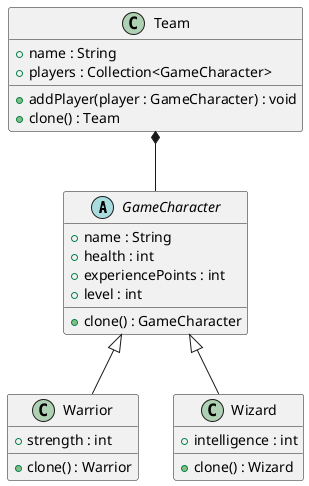

# Rapport de Projet : RPG avec Design Patterns

## Introduction

Ce projet est une implémentation d’un jeu RPG en Java, conçu selon les principes de conception orientés objet et en utilisant des **design patterns**. L'objectif principal était de créer une architecture flexible, extensible, et maintenable pour le jeu, tout en intégrant plusieurs patterns de conception pour résoudre des problèmes spécifiques.

---

## Design Patterns Implémentés et leur Rôle

### 1. **Singleton**

Le Singleton est un design pattern qui garantit qu'une classe n'a qu'une seule instance tout en fournissant un point d'accès global à cette instance.

- **Rôle** :  
Dans le cadre de ce projet RPG, le Singleton est utilisé pour gérer la configuration globale du jeu via la classe `GameConfiguration`. Cette classe stocke des paramètres critiques comme le niveau de difficulté (`difficultyLevel`) et la taille maximale d’une équipe (`maxTeamSize`). Ces paramètres influencent directement le comportement global du jeu, comme la force et le nombre d'ennemis, ainsi que la composition des équipes.  
En centralisant ces paramètres dans une instance unique, le Singleton assure qu’il n’existe qu’une seule source de vérité pour ces données. Cela simplifie la gestion et évite des incohérences potentielles si plusieurs instances de configuration existaient.

- **Problème Résolu** :  
Le Singleton résout plusieurs problèmes de conception importants dans le jeu :
  - **Centralisation des paramètres globaux** : Les paramètres critiques sont accessibles partout dans l'application via une seule instance partagée.
  - **Prévention des duplications** : En interdisant la création de multiples instances de configuration, le Singleton empêche des incohérences qui pourraient surgir si différentes parties de l'application utilisaient des paramètres divergents.
  - **Contrôle unique des modifications** : Toute modification des paramètres globaux est immédiatement reflétée dans l'ensemble du système, car tous les modules utilisent la même instance.

- **Implémentation et Tests Unitaires** :  
L'implémentation du Singleton se fait dans la classe `GameConfiguration`. Les tests unitaires validant cette implémentation comprennent :
  - **Test d'unicité** : Vérifie que la méthode `getInstance()` retourne toujours la même instance.
  - **Test de gestion des paramètres globaux** : S'assure que les paramètres globaux peuvent être définis et lus correctement.

#### Diagramme de Classe du Singleton



---

### 2. **Factory Method**

Le **Factory Method** est un design pattern qui définit une interface pour créer un objet, tout en permettant aux sous-classes de décider quelle classe concrète instancier.

- **Rôle** :  
Le Factory Method est utilisé pour centraliser et simplifier la création de différents types de personnages en utilisant une interface `CharacterCreator`. Chaque type de personnage (par exemple, `Warrior` ou `Wizard`) possède sa propre logique de création encapsulée dans des classes concrètes (`WarriorCreator` et `WizardCreator`).

- **Problème Résolu** :  
Le Factory Method résout plusieurs problèmes de conception importants :
  - **Encapsulation de la logique de création** : La logique spécifique à chaque type de personnage est confinée dans des classes dédiées.
  - **Extensibilité** : Ajouter de nouveaux types de personnages est simple en créant de nouvelles classes qui implémentent `CharacterCreator`.
  - **Réduction des dépendances directes** : Le code client dépend uniquement de l'interface `CharacterCreator`, évitant les dépendances sur les implémentations concrètes.

- **Implémentation et Tests Unitaires** :  
L'implémentation du Factory Method repose sur l'interface `CharacterCreator` et ses implémentations concrètes. Les tests unitaires validant cette implémentation comprennent :
  - **Test de création de Warrior** : Vérifie que la méthode `createCharacter` de `WarriorCreator` crée correctement une instance de `Warrior` avec le nom spécifié.
  - **Test de création de Wizard** : Vérifie que la méthode `createCharacter` de `WizardCreator` crée correctement une instance de `Wizard` avec le nom spécifié.

#### Diagramme de Classe du Factory Method



---

### 3. **Prototype**

Le **Prototype** est un design pattern qui permet de créer de nouveaux objets en clonant des instances existantes, au lieu de les instancier directement. Ce pattern est particulièrement utile lorsque la création d’un objet est coûteuse ou complexe.

- **Rôle** :  
Le Prototype est utilisé pour faciliter la création d’équipes en clonant une équipe type. Cette approche permet de créer rapidement des copies d’équipes complètes avec leurs joueurs tout en préservant l'indépendance entre les copies. Chaque joueur d'une équipe est également cloné, garantissant une duplication profonde (deep copy) des objets.

- **Problème Résolu** :  
Le Prototype résout plusieurs problèmes de conception :
  - **Réduction de la complexité de création** : Permet de réutiliser une équipe existante comme modèle pour créer rapidement de nouvelles équipes.
  - **Indépendance des objets clonés** : Chaque équipe et ses joueurs sont indépendants, ce qui signifie que les modifications effectuées sur un clone n'affectent pas l'original.
  - **Extensibilité** : Le Prototype facilite l'ajout de nouveaux types de personnages ou d'équipes sans nécessiter de modification des logiques existantes.

- **Implémentation et Tests Unitaires** :  
L'implémentation du Prototype repose sur les classes `GameCharacter` et `Team`. Les tests unitaires validant cette implémentation comprennent :
  - **Test de clonage d'équipe** : Vérifie que la méthode `clone` crée une nouvelle équipe avec des joueurs identiques en termes de contenu mais indépendants en mémoire.

#### Diagramme de Classe du Prototype



---

### 4. **Builder**

Le **Builder** est un design pattern qui permet de construire des objets complexes de manière progressive en utilisant une interface ou une classe dédiée. Il est particulièrement utile pour créer des objets comportant de nombreuses options ou étapes de configuration.

- **Rôle** :  
Le Builder est utilisé pour créer des équipes (`Team`) en ajoutant progressivement des personnages (`GameCharacter`) tels que des guerriers (`Warrior`) et des sorciers (`Wizard`). Cette approche permet de configurer des équipes de manière fluide et flexible. À l'avenir, d'autres types d'éléments (par exemple, des véhicules ou des familiers) pourraient également être ajoutés grâce à cette structure.

- **Problème Résolu** :  
Le Builder résout plusieurs problèmes de conception :
  - **Construction progressive** : Permet d'ajouter des éléments à une équipe étape par étape, sans avoir à fournir toutes les informations à l'avance.
  - **Lisibilité et fluidité** : Grâce à l'utilisation d'une interface fluide (méthodes chaînées), la création d'équipes est claire et concise.
  - **Extensibilité** : De nouveaux types d'éléments peuvent être ajoutés au processus de construction sans modifier la structure existante.

- **Implémentation et Tests Unitaires** :  
L'implémentation du Builder repose sur la classe `TeamBuilder`, qui offre des méthodes pour ajouter différents types de personnages. Les tests unitaires validant cette implémentation comprennent :
  - **Test de construction d'équipe** : Vérifie que la méthode `build()` crée une équipe contenant les personnages ajoutés au cours du processus de construction.

#### Diagramme de Classe du Builder

```plantuml
class TeamBuilder {
    - team : Team
    + TeamBuilder(name : String)
    + addWarrior(name : String) : TeamBuilder
    + addWizard(name : String) : TeamBuilder
    + build() : Team
}

class Team {
    + name : String
    + players : Collection<GameCharacter>
    + addPlayer(player : GameCharacter) : void
}

TeamBuilder *-- Team
Team o-- GameCharacter
```

---

### 5. **Visitor**

Le **Visitor** est un design pattern qui permet de définir de nouvelles opérations sur une structure d'objets sans en modifier les classes. Ce design pattern favorise l'extensibilité des comportements tout en respectant le principe de responsabilité unique.

- **Rôle** :  
Le Visitor est utilisé pour appliquer des opérations spécifiques sur différents types de personnages (`GameCharacter`). Les visiteurs implémentés incluent :
  - **BuffVisitor** : Augmente les caractéristiques du personnage en fonction de son type.
  - **DamageVisitor** : Inflige des dégâts au personnage, réduisant ses points de vie.
  - **HealVisitor** : Soigne le personnage en augmentant ses points de vie, sans dépasser un maximum prédéfini.

- **Problème Résolu** :  
Le Visitor résout plusieurs problèmes de conception :
  - **Séparation des comportements** : Les opérations appliquées aux personnages sont séparées de leurs classes, simplifiant leur maintenance et leur évolutivité.
  - **Extensibilité** : De nouvelles opérations (visiteurs) peuvent être ajoutées sans modifier les classes des personnages.
  - **Réutilisabilité** : Les visiteurs peuvent être réutilisés sur différents types de personnages ou de structures.

- **Implémentation et Tests Unitaires** :  
L'implémentation repose sur une interface `CharacterVisitor` avec des méthodes spécifiques pour chaque type de personnage (`Warrior`, `Wizard`). Les tests unitaires valident :
  - **Application des visiteurs individuellement** : Vérifie que chaque visiteur (Buff, Damage, Heal) produit les effets attendus sur les personnages.
  - **Scénarios combinés** : Teste l'effet des visites successives pour simuler des interactions complexes.

#### Diagramme de Classe du Visitor

```plantuml
interface CharacterVisitor {
    + visit(Warrior warrior) : void
    + visit(Wizard wizard) : void
}

class BuffVisitor {
    + visit(Warrior warrior) : void
    + visit(Wizard wizard) : void
}

class DamageVisitor {
    + visit(Warrior warrior) : void
    + visit(Wizard wizard) : void
}

class HealVisitor {
    + visit(Warrior warrior) : void
    + visit(Wizard wizard) : void
}

class GameCharacter {
    + accept(visitor : CharacterVisitor) : void
    + name : String
    + health : int
}

class Warrior {
    + strength : int
}

class Wizard {
    + intelligence : int
}

GameCharacter <|-- Warrior
GameCharacter <|-- Wizard

GameCharacter *-- CharacterVisitor
CharacterVisitor <|.. BuffVisitor
CharacterVisitor <|.. DamageVisitor
CharacterVisitor <|.. HealVisitor
```

---

### 6. **Strategy**

Le **Strategy** est un design pattern qui permet de définir une famille d'algorithmes, de les encapsuler individuellement et de les rendre interchangeables. Ce pattern favorise la flexibilité en permettant de modifier dynamiquement le comportement d'un objet.

- **Rôle** :  
Le Strategy est utilisé pour gérer les comportements de combat des personnages (`GameCharacter`). Chaque personnage peut adopter différentes stratégies de combat, modifiant dynamiquement son comportement selon les besoins du jeu :
  - **AggressiveStrategy** : Inflige plus de dégâts, mais subit également davantage de dommages.
  - **DefensiveStrategy** : Inflige moins de dégâts, mais subit également moins de dommages.
  - **NeutralStrategy** : Comporte un comportement équilibré sans modification des dégâts infligés ou subis.

- **Problème Résolu** :  
Le Strategy résout plusieurs problèmes de conception :
  - **Encapsulation des comportements** : Les différentes logiques de combat sont séparées dans des classes dédiées, simplifiant la maintenance et l'évolution.
  - **Flexibilité dynamique** : Les personnages peuvent changer de stratégie de combat en cours de jeu, offrant une grande adaptabilité.
  - **Réduction des conditions** : Évite les instructions conditionnelles complexes dans les classes des personnages.

- **Implémentation et Tests Unitaires** :  
L'implémentation repose sur l'interface `CombatStrategy` et ses implémentations concrètes (`AggressiveStrategy`, `DefensiveStrategy`, `NeutralStrategy`). Les tests unitaires valident :
  - **Effets de chaque stratégie** : Vérifie que les dégâts infligés et subis sont correctement modifiés selon la stratégie active.
  - **Changement dynamique de stratégie** : Vérifie que le comportement d'un personnage peut être modifié en cours de jeu en changeant de stratégie.

#### Diagramme de Classe du Strategy

```plantuml
interface CombatStrategy {
    + calculateDamageDealt(baseDamage : int) : int
    + calculateDamageTaken(baseDamage : int) : int
}

class AggressiveStrategy {
    + calculateDamageDealt(baseDamage : int) : int
    + calculateDamageTaken(baseDamage : int) : int
}

class DefensiveStrategy {
    + calculateDamageDealt(baseDamage : int) : int
    + calculateDamageTaken(baseDamage : int) : int
}

class NeutralStrategy {
    + calculateDamageDealt(baseDamage : int) : int
    + calculateDamageTaken(baseDamage : int) : int
}

class GameCharacter {
    + setCombatStrategy(strategy : CombatStrategy) : void
    + attack(baseDamage : int) : int
    + defend(baseDamage : int) : int
    - combatStrategy : CombatStrategy
}

GameCharacter o-- CombatStrategy
CombatStrategy <|.. AggressiveStrategy
CombatStrategy <|.. DefensiveStrategy
CombatStrategy <|.. NeutralStrategy
```

---

### 7. **Observer**

Le **Observer** est un design pattern qui définit une relation de dépendance un-à-plusieurs entre des objets, permettant à un ou plusieurs observateurs d'être informés automatiquement des changements d'état d'un objet.

- **Rôle** :  
Le Observer est utilisé pour notifier des observateurs (`Observer`) des changements d'état des personnages (`GameCharacter`) :
  - **LevelUpObserver** : Notifie lorsque le personnage monte de niveau.
  - **DeathObserver** : Notifie lorsque le personnage meurt.

- **Problème Résolu** :  
Le Observer résout plusieurs problèmes de conception :
  - **Notification automatique** : Les observateurs sont automatiquement informés des changements sans intervention manuelle.
  - **Découplage** : Les observateurs et les sujets sont faiblement couplés, permettant une évolutivité et une modularité accrues.
  - **Extensibilité** : De nouveaux observateurs peuvent être ajoutés sans modifier le sujet.

- **Implémentation et Tests Unitaires** :  
L'implémentation repose sur une interface `Observer`, des classes concrètes pour chaque observateur, et une classe `Subject` qui gère l'inscription et la notification des observateurs. Les tests unitaires valident :
  - **Notification des événements** : Vérifie que les observateurs sont informés des événements pertinents.
  - **Ajout et suppression d'observateurs** : Vérifie que les observateurs peuvent être ajoutés ou retirés dynamiquement.

#### Diagramme de Classe du Observer

```plantuml
interface Observer {
    + update(character : GameCharacter, event : String) : void
}

class LevelUpObserver {
    + update(character : GameCharacter, event : String) : void
}

class DeathObserver {
    + update(character : GameCharacter, event : String) : void
}

class Subject {
    - observers : List<Observer>
    + addObserver(observer : Observer) : void
    + removeObserver(observer : Observer) : void
    + notifyObservers(character : GameCharacter, event : String) : void
}

class GameCharacter {
    + setHealth(health : int) : void
    + setLevel(level : int) : void
    + notify(event : String) : void
}

GameCharacter o-- Subject
Subject *-- Observer
Observer <|.. LevelUpObserver
Observer <|.. DeathObserver
```

---

### 8. **Decorator**

Le **Decorator** est un deisgn pattern qui permet d'ajouter dynamiquement des fonctionnalités ou de modifier le comportement d'un objet sans altérer son code source. Les objets décorés conservent la même interface, permettant une composition flexible des comportements.

- **Rôle** :  
Le Decorator est utilisé pour enrichir dynamiquement les personnages (`GameCharacter`) avec des capacités supplémentaires :
  - **ArmoredDecorator** : Réduit les dégâts subis par un personnage en introduisant une valeur d'armure.
  - **InvincibleDecorator** : Empêche les points de vie d'un personnage de descendre en dessous de 1, garantissant qu'il ne puisse pas mourir.

- **Problème Résolu** :  
Le Decorator résout plusieurs problèmes de conception :
  - **Ajout de fonctionnalités dynamiques** : Les décorateurs permettent d'ajouter ou de retirer des fonctionnalités sans modifier la classe de base.
  - **Composition de comportements** : Plusieurs décorateurs peuvent être combinés pour enrichir les fonctionnalités d'un objet.
  - **Réduction des sous-classes** : Évite une explosion du nombre de sous-classes nécessaires pour combiner différents comportements.

- **Implémentation et Tests Unitaires** :  
L'implémentation repose sur une classe abstraite `CharacterDecorator`, qui étend `GameCharacter` et redirige les appels vers l'objet décoré. Les tests unitaires valident :
  - **Effet individuel des décorateurs** : Vérifie les modifications apportées par `ArmoredDecorator` et `InvincibleDecorator`.
  - **Combinaison de décorateurs** : Vérifie que plusieurs décorateurs peuvent être appliqués simultanément sans conflits.

#### Diagramme de Classe du Decorator

```plantuml
abstract class GameCharacter {
    + attack(baseDamage : int) : int
    + defend(baseDamage : int) : int
    + setHealth(health : int) : void
    + getHealth() : int
}

class Warrior {
    + strength : int
}

class Wizard {
    + intelligence : int
}

abstract class CharacterDecorator extends GameCharacter {
    - decoratedCharacter : GameCharacter
    + getDecoratedCharacter() : GameCharacter
}

class ArmoredDecorator {
    - armorValue : int
    + defend(baseDamage : int) : int
}

class InvincibleDecorator {
    + setHealth(health : int) : void
}

GameCharacter <|-- Warrior
GameCharacter <|-- Wizard
GameCharacter <|-- CharacterDecorator
CharacterDecorator <|-- ArmoredDecorator
CharacterDecorator <|-- InvincibleDecorator
```

---

### 9. **Command**

Le **Command** est un deisgn pattern qui encapsule une demande en tant qu'objet, permettant ainsi de paramétrer des objets avec des requêtes différentes, de mettre en file d'attente ou de journaliser des requêtes, et de supporter des opérations annulables.

- **Rôle** :  
Le Command est utilisé pour représenter des actions spécifiques sous forme de commandes exécutables, telles que :
  - **AttackCommand** : Permet à une équipe d’attaquer une autre.
  - **BuffCommand** : Applique des améliorations (`BuffVisitor`) à une équipe.
  - **HealCommand** : Restaure les points de vie des personnages d'une équipe.

Chaque commande peut être exécutée et annulée dynamiquement grâce à l'interface `Command`.

- **Problème Résolu** :  
Le Command résout plusieurs problèmes de conception :
  - **Encapsulation des actions** : Les commandes encapsulent la logique des actions, séparant ainsi l'invocation de l'implémentation.
  - **Extensibilité** : De nouvelles commandes peuvent être ajoutées sans modifier les classes existantes.
  - **Historique et annulation** : Les commandes permettent de garder un historique des actions et de les annuler si nécessaire.

- **Implémentation et Tests Unitaires** :  
L'implémentation repose sur l'interface `Command`, des commandes concrètes (`AttackCommand`, `HealCommand`, etc.), et une classe `GameInvoker` qui gère leur exécution et leur historique. Les tests unitaires valident :
  - **Exécution des commandes** : Vérifie que les commandes produisent les effets attendus.
  - **Annulation des commandes** : Vérifie que les commandes restaurent l'état précédent lorsqu'elles sont annulées.

#### Diagramme de Classe du Command

```plantuml
interface Command {
    + execute() : void
    + undo() : void
}

class AttackCommand {
    - attackerTeam : Team
    - defenderTeam : Team
    + execute() : void
    + undo() : void
}

class HealCommand {
    - team : Team
    + execute() : void
    + undo() : void
}

class BuffCommand {
    - team : Team
    + execute() : void
    + undo() : void
}

class GameInvoker {
    - commandHistory : List<Command>
    + addCommand(command : Command) : void
    + executeCommands() : void
    + undoLastCommand() : void
}

Command <|.. AttackCommand
Command <|.. HealCommand
Command <|.. BuffCommand
GameInvoker o-- Command
```

---

### 10. **State**

Le **State** est un design pattern qui permet à un objet de changer son comportement lorsque son état interne change. L'objet semble alors modifier sa classe à l'exécution.

- **Rôle** :  
Le State est utilisé pour représenter les différents états d'un personnage (`GameCharacter`), tels que :
  - **NormalState** : Le personnage est en pleine forme.
  - **WoundedState** : Le personnage est blessé et affaibli.
  - **ScaredState** : Le personnage agit sous l'influence de la peur.
  - **DeadState** : Le personnage est mort et ne peut plus agir.

Les transitions entre états sont déclenchées par des événements internes, et chaque état implémente un comportement unique pour les actions du personnage.

- **Problème Résolu** :  
Le State résout plusieurs problèmes de conception :
  - **Gestion de comportements dynamiques** : Les actions d'un personnage s'adaptent à son état actuel sans multiplier les conditions complexes.
  - **Encapsulation des états** : Chaque état est encapsulé dans une classe distincte, rendant le code plus lisible et modulaire.
  - **Transitions gérées par les états** : Les transitions sont définies au sein des classes d'état elles-mêmes, évitant de surcharger le code du personnage.

- **Implémentation et Tests Unitaires** :  
L'implémentation repose sur une interface `State`, des états concrets (`NormalState`, `WoundedState`, etc.), et la classe `GameCharacter` qui délègue les comportements à son état actuel. Les tests unitaires valident :
  - **Transitions d'état** : Vérifie que les personnages changent correctement d'état.
  - **Comportements spécifiques à chaque état** : Vérifie que les actions du personnage correspondent à son état actuel.

#### Diagramme de Classe du State

```plantuml
interface State {
    + onEnterState(character : GameCharacter) : void
    + onUpdate(character : GameCharacter) : void
    + onTryToMove(character : GameCharacter) : void
    + onAttack(character : GameCharacter) : void
}

class NormalState {
    + onEnterState(character : GameCharacter) : void
    + onUpdate(character : GameCharacter) : void
    + onTryToMove(character : GameCharacter) : void
    + onAttack(character : GameCharacter) : void
}

class WoundedState {
    + onEnterState(character : GameCharacter) : void
    + onUpdate(character : GameCharacter) : void
    + onTryToMove(character : GameCharacter) : void
    + onAttack(character : GameCharacter) : void
}

class ScaredState {
    + onEnterState(character : GameCharacter) : void
    + onUpdate(character : GameCharacter) : void
    + onTryToMove(character : GameCharacter) : void
    + onAttack(character : GameCharacter) : void
}

class DeadState {
    + onEnterState(character : GameCharacter) : void
    + onUpdate(character : GameCharacter) : void
    + onTryToMove(character : GameCharacter) : void
    + onAttack(character : GameCharacter) : void
}

class GameCharacter {
    + setState(state : State) : void
    + getState() : State
    + tryToMove() : void
    + attack() : void
    - currentState : State
}

GameCharacter o-- State
State <|.. NormalState
State <|.. WoundedState
State <|.. ScaredState
State <|.. DeadState
```

---

### 11. **Interface Utilisateur via Game Facade**

La **Facade** est un design pattern qui fournit une interface simplifiée pour interagir avec un système complexe. Ici, le `GameFacade` agit comme une interface utilisateur pour gérer les équipes, leurs actions, et les interactions entre les personnages.

- **Rôle** :  
Le `GameFacade` simplifie l'interaction avec le système en regroupant plusieurs opérations complexes sous une interface unique et facile à utiliser :
  - **Gestion des équipes** : Ajouter, supprimer, ou lister des équipes.
  - **Actions sur les équipes** : Permet aux équipes d’attaquer, d’être soignées ou améliorées.
  - **Personnages décorés** : Ajout ou suppression dynamique de décorateurs (`CharacterDecorator`).

- **Problème Résolu** :  
La Facade résout plusieurs problèmes de conception :
  - **Simplification de l'accès** : Regroupe les opérations complexes sous une interface simple, masquant les détails d'implémentation.
  - **Modularité** : Facilite l’ajout de nouvelles fonctionnalités sans modifier directement les sous-systèmes.
  - **Centralisation** : Offre un point d’entrée unique pour interagir avec le système de jeu.

#### Diagramme de Classe de la Facade

```plantuml
class GameFacade {
    + addTeam(team : Team) : void
    + removeTeam(team : Team) : void
    + getTeam(name : String) : Team
    + getAllTeams() : List<Team>
    + teamAttack(attacker : Team, defender : Team) : void
    + healTeam(team : Team) : void
    + buffTeam(team : Team) : void
    + decorateCharacter(character : GameCharacter, decoratorClass : Class<? extends CharacterDecorator>) : GameCharacter
    + removeDecorator(character : GameCharacter) : void
    + listTeams() : void
}

class Team {
    + getName() : String
    + getPlayers() : Collection<GameCharacter>
    + addPlayer(player : GameCharacter) : void
}

class GameCharacter {
    + getName() : String
    + setHealth(health : int) : void
    + attack(baseDamage : int) : int
    + defend(baseDamage : int) : int
}

class CharacterDecorator {
    + getDecoratedCharacter() : GameCharacter
}

GameFacade o-- Team
GameFacade o-- GameCharacter
GameCharacter <|-- CharacterDecorator
```

---

### Diagramme Global du Projet

Voici le diagramme UML global montrant les interconnexions entre les classes et les patterns utilisés dans le projet. Ce diagramme fournit une vue d'ensemble des relations entre les différents composants du système, tels que les personnages, les équipes, les états, les commandes, et la façade. Vous pouvez le consulter dans le fichier suivant : [Diagramme Global UML](./rpg.puml)
